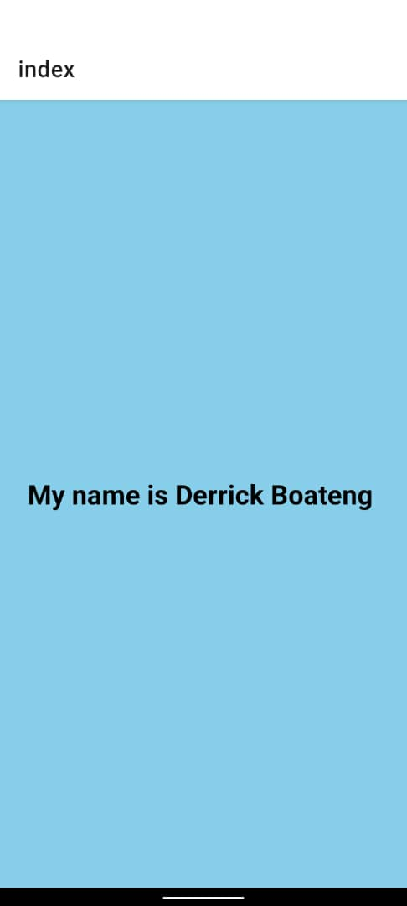

# React Native App

## Description

This is a simple React Native application that displays the text "My name is YourName" on the screen. The background color of the screen is set to a light blue color, and the font size of the text is increased to 24 points. Additionally, the name "YourName" is displayed in bold.

## Screenshot



## Task

1. Change the background color of the `View` component to a light blue color.
2. Edit the `Text` component to display "My name is YourName".
3. Increase the font size of the text to 24 points.
4. Make the name "YourName" bold.
5. Add a README file with a screenshot of the application and a description of the task.

# Welcome to your Expo app 👋

This is an [Expo](https://expo.dev) project created with [`create-expo-app`](https://www.npmjs.com/package/create-expo-app).

## Get started

1. Install dependencies

   ```bash
   npm install
   ```

2. Start the app

   ```bash
    npx expo start
   ```

In the output, you'll find options to open the app in a

- [development build](https://docs.expo.dev/develop/development-builds/introduction/)
- [Android emulator](https://docs.expo.dev/workflow/android-studio-emulator/)
- [iOS simulator](https://docs.expo.dev/workflow/ios-simulator/)
- [Expo Go](https://expo.dev/go), a limited sandbox for trying out app development with Expo

You can start developing by editing the files inside the **app** directory. This project uses [file-based routing](https://docs.expo.dev/router/introduction).

## Get a fresh project

When you're ready, run:

```bash
npm run reset-project
```

This command will move the starter code to the **app-example** directory and create a blank **app** directory where you can start developing.
